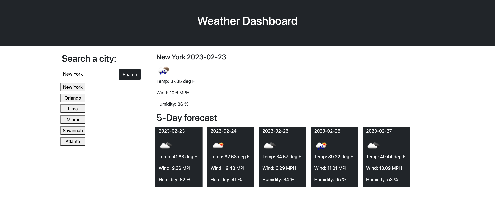

# My-Weather-API

## Description
This webpage was created to give weather information. You can type a city name on the input line and the current weather along with a 5 day forecast will shoiw up. Whenever  you type different city names it will be store the previous cities typed. You can click on the previous city names and the webpage will ugrade and give you the the current weather and 5 day forecast. 

## Links

- [Live](https://tlequernaque.github.io/My-Weather-API/)

## Screenshots

## Available Commands

N/A

## Built With

- HTML
- CSS
- JavaScript

## Future Updates

- N/A

## Author

**Terry Lequernaque**

- [Email](mailto:t.lequernaque@yahoo.com?subject=Hi "Hi!")

## 🤝 Support

Contributions, issues, and feature requests are welcome!

Give a ⭐️ if you like this project!